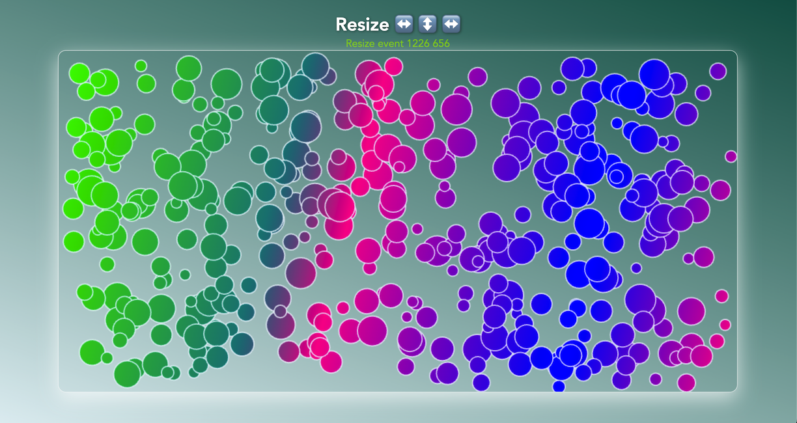

# Marvel Marbels  

The script generates fancy colorful marbels for the sake of demonstrating how object oriented programming works. Resize the window to understand more and have fun watching them bouncing off  the bounderies defined.


## Installation

1. Clone the repository:
   ```bash
   git clone https://github.com/tpreisig/marvel-marbles.git
   ```
2. Navigate to the project directory:
   ```bash
   cd marvel-marbles
   ```
3. open application:
   ```bash
   open index.html
   ```

## License

This project is licensed under the MIT License - see the [LICENSE](LICENSE) file for details.

## Screenshots



## Contact

Maintained by tpreisig - feel free to reach out!

