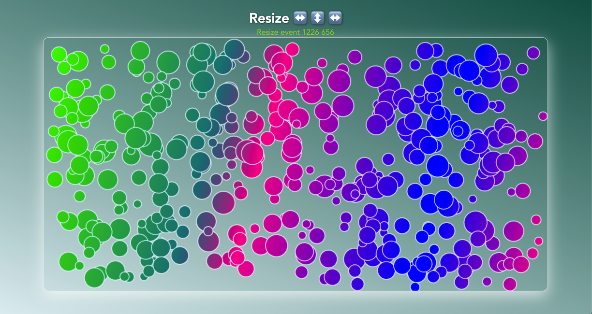

# Marvel Marbles  


A JavaScript-based animation that creates colorful bouncing particles (circles) on an HTML canvas. The particles move around the canvas, bounce off the edges, and are filled with a linear gradient for a vibrant effect. The animation is responsive to window resizing and runs smoothly in modern browsers.
Resize the window to understand more and have fun watching them bouncing off the bounderies defined.

## Features

- Generates a configurable number of particles (default: 200) with random sizes, positions, and velocities (both horizontal and vertical for dynamic movement).
- Particles bounce off canvas edges.
- Uses a linear gradient for particle colors (lime, teal, deep pink, blue).
- Handles window resizing with debouncing for performance, adjusting canvas dimensions and resetting particle positions.
- Smooth animation loop using `requestAnimationFrame`.
- Improved performance: Efficient gradient creation, no redundant drawing, and extracted configurable properties.


## Demo 


## Installation
1. Clone the repository:
   ```bash
   git clone https://github.com/tpreisig/marvel-marbles.git
   ```
2. Navigate to the project directory:
   ```bash
   cd marvel-marbles
   ```
3. open application:
   ```bash
   open index.html
   ```

## Code Explantion
### Overview
- Particle Class: Represents a single particle (circle). It handles drawing (with gradient fill and stroke), updating position (with bouncing logic), and resetting on resize.
- Effect Class: Manages the canvas, creates and updates multiple particles, handles resizing with debouncing, and provides a method to create the gradient.
- Global Logic: On window load, initializes the canvas, creates an Effect instance, generates an initial gradient, and starts an animation loop that clears the canvas and redraws particles each frame.

### Key Components
- Particle Movement: Each particle has random horizontal (vx) and vertical (vy) velocities. They bounce by reversing velocity on edge collision.
- Gradient: A linear gradient is created for colorful fills. It's generated on load and can be recreated if needed (e.g., on resize for dynamic adjustments, though currently static for performance).
- Resize Handling: The canvas is scaled to a configurable portion of the window size, and particles are reset to new random positions within bounds. Debouncing prevents performance issues during rapid resizing.
- Animation Loop: Uses requestAnimationFrame for efficient, browser-optimized rendering.
Configurable Properties: Magic numbers (e.g., particle count, scale factors) are extracted for easy customization.

## License

This project is licensed under the MIT License - see the [LICENSE](LICENSE) file for details.


## Contact

Maintained by tpreisig - feel free to reach out!

